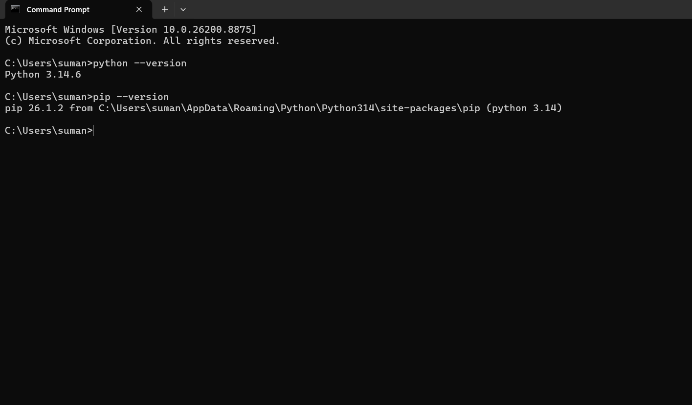
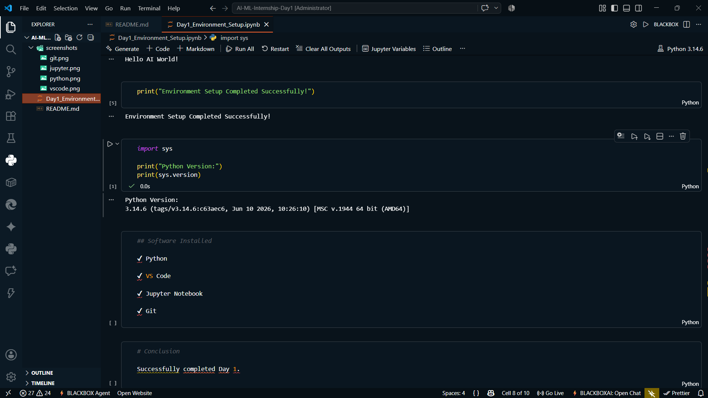
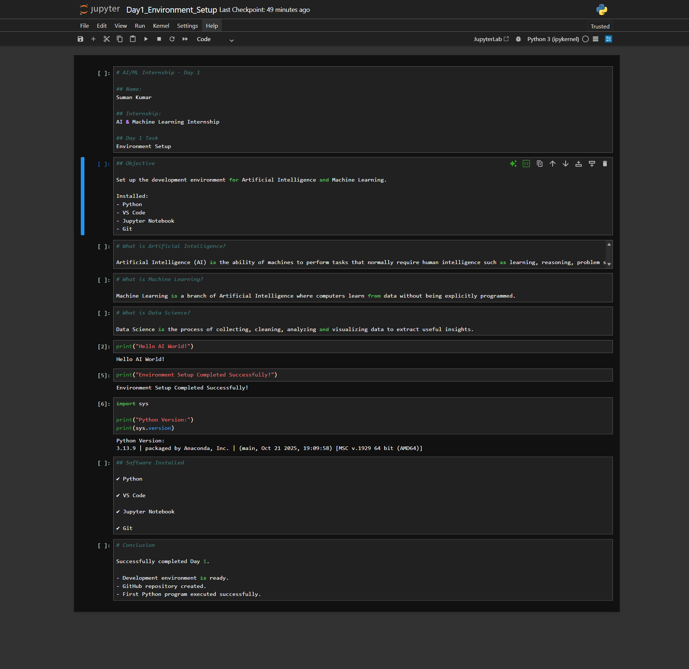
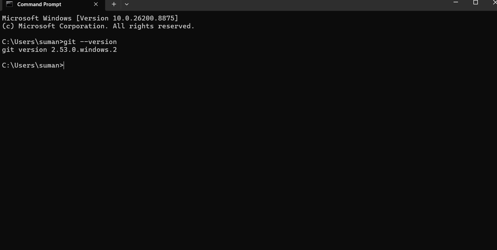

# AI & ML Internship – Day 1

## 👨‍💻 Author
**Name:** Suman Kumar

## 📌 Project Title
Environment Setup for AI & Machine Learning

## 🎯 Objective
The objective of Day 1 is to set up the development environment required for Artificial Intelligence and Machine Learning and run the first Python program.

## ✅ Tasks Completed
- Installed Python
- Installed VS Code
- Installed Jupyter Notebook
- Installed Git
- Learned the basics of Artificial Intelligence (AI)
- Learned the basics of Machine Learning (ML)
- Learned the basics of Data Science
- Created a GitHub repository
- Executed the first Python program

## 🛠️ Tools Used
- Python 3.14.6
- Visual Studio Code
- Jupyter Notebook
- Git
- GitHub

## 📂 Repository Structure

```
AI-ML-Internship-Day1/
│
├── Day1_Environment_Setup.ipynb
├── README.md
└── screenshots/
    ├── python.png
    ├── vscode.png
    ├── jupyter.png
    └── git.png
```

## 🚀 Output
- Development environment successfully configured.
- First Python program executed successfully.
- Ready to begin AI & Machine Learning development.

## 📷 Screenshots
Screenshots of Python, VS Code, Jupyter Notebook, and Git are available in the `screenshots` folder.

### Python


### VS Code


### Jupyter Notebook


### Git


## 📜 License
This project is created for educational purposes as part of the AI & Machine Learning Internship.
